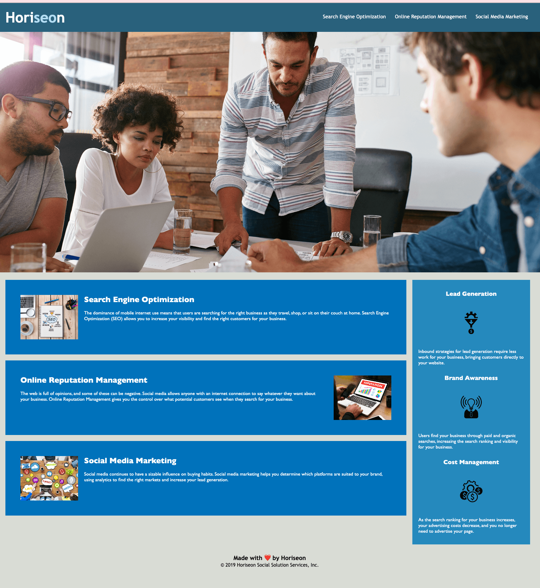
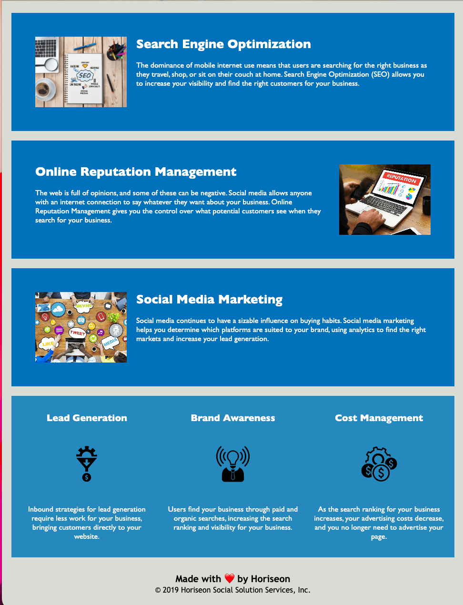

# Horiseon Digital Marketing

## Bootcamp Coding Challenge 1

**A fully responsive and accessible landing page for the digital marketing firm, Horiseon**

 

###Problems Solved:

- Refactored HTML code to use semantic elements.
- Refactored CSS to adhere to the DRY code concept.
- Optimized images for a lighter application and faster page load.
- Replaced the Float properties with more up to date Flexbox and Grid properties.
- Added media queries to make the site fully responsive on desktop and mobile.

- In the header I added a hamburger icon along with a pop out nav menu for screen sizes below 600px.

<table>
<tr>
<td style="border:none">

</td>
<td style="border:none">
 
</td>
<td style="border:none">

</td>
</tr>
</table>

### Credits

Starter Code by [Xandromus](https://github.com/Xandromus)

Refactored by [Shanel Beebe](https://github.com/shanelbb)
